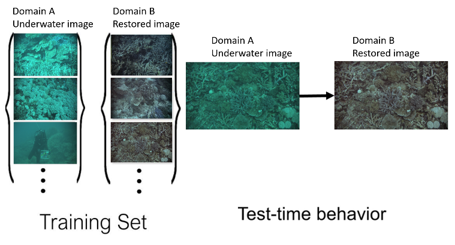
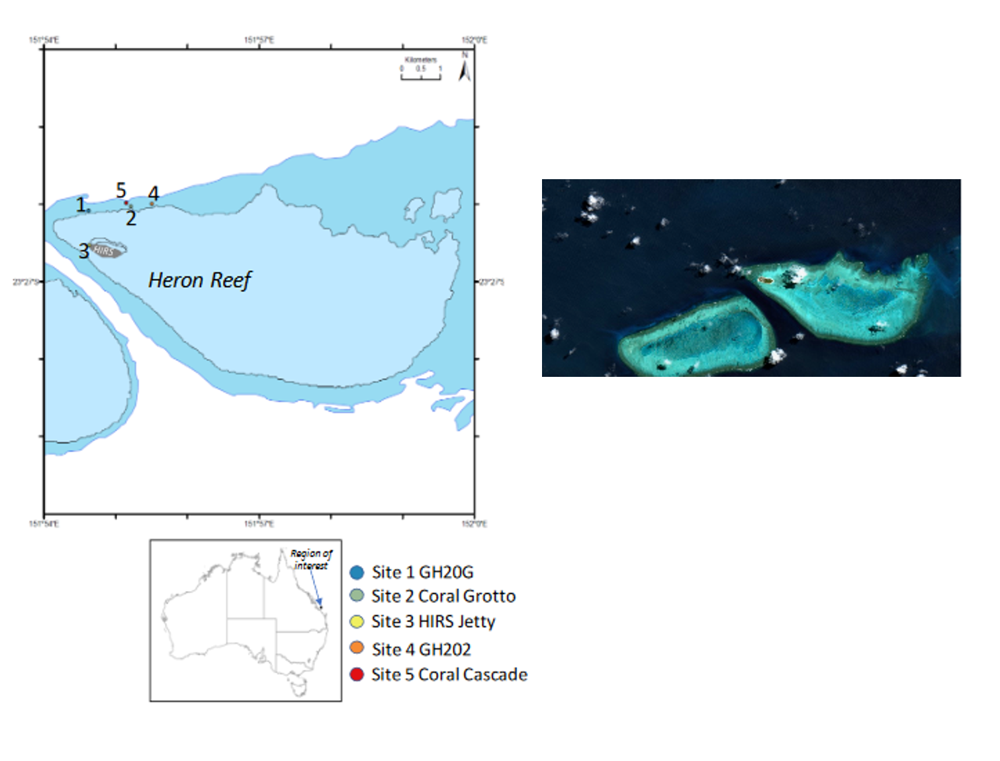

[arxiv](https://arxiv.org/abs/2103.09697)

# Contrastive UnderWater Restoration (CWR)
We provide our PyTorch implementation for paper "Single Underwater Image Restoration by Contrastive Learning". CWR is designed for underwater image restoration, but not limited to it. It performs style-transfer to all kinds of low-level vision tasks (e.g. Dehaze, Underwater image enhancement, Deraining) while keeping the structure identical.

CWR achieves SOTA performances in underwater image restoration task using HICRD (Heron Island Coral Reef Dataset) as the training data.

CWR and other unsupervised learning-based model works like:



Before restoration:


After restoration:


## Prerequisites
Python 3.6 or above.

For packages, see requirements.txt.

### Getting started

- Clone this repo:
```bash
git clone
```

- Install PyTorch 1.4 or above and other dependencies (e.g., torchvision, visdom, dominate, gputil).

  For pip users, please type the command `pip install -r requirements.txt`.

  For Conda users,  you can create a new Conda environment using `conda env create -f environment.yml`.
  
### CWR Training and Test

- A one image train/test example example HICRD is provided.

- To view training results and loss plots, run `python -m visdom.server` and click the URL http://localhost:8097.

- Train the CWR model with test HICRD dataset:
```bash
python train.py --dataroot ./datasets/HICRD --name HICRD_small
```
The checkpoints will be stored at `./checkpoints/HICRD_small/web`.

- Test the CWR model:
```bash
python test.py --dataroot ./datasets/HICRD --name HICRD_small --preprocess scale_width --load_size 1024
```
The test results will be saved to a html file here: `./results/HICRD_small/latest_test/index.html`.

### Pre-trained CWR model
We provide our pre-trained models:

Pre-trained CWR: https://drive.google.com/file/d/1-Ouzzup2jNdg1PoYaQIjd-tm9K3LvwVl/view?usp=sharing

### Use the pre-trained model 
1: Download the whole HICRD dataset and replace ./dataset/HICRD (optional)

2: Download the pre-tained model, unzip it and put it inside ./checkpoints (You may need to create checkpoints folder by yourself if you didn't run the training code).

```bash
python test.py --dataroot ./datasets/HICRD --name HICRD_CWR --preprocess scale_width --load_size 1024
```

The test results will be saved to a html file here: `./results/HICRD_CWR/latest_test/index.html`.

For FID score, use [pytorch-fid](https://github.com/mseitzer/pytorch-fid).

Test the FID score:
```bash
python -m pytorch_fid ./results/HICRD_CWR/test_latest/images/fake_B ./results/HICRD_CWR/test_latest/images/real_B
```

### Datasets

Heron Island Coral Reef Dataset (HICRD) contains 6003 low-quality images, 3472 good-quality images, and 2000 restored images. We use low-quality images and restored images as the unpaired training set (trainA + trainB). In contrast, the paired training set contains good-quality images and corresponding restored images. The test set contains 300 good-quality images (testA) as well as 300 paired restored images (testB) as ground truth. All images are in 1842 x 980 resolution.

Data is collected in Heron Island, Queensland, Australia. The collection of raw images is led by Janet Anstree, the reference images are produced by Junlin Han. The copyright belongs to CSIRO (Commonwealth Scientific and Industrial Research Organisation).

Location of Heron Island:



The whole HICRD is coming soon... Should be releasd before May.


### Citation
If you use our code/results/dataset, please cite our paper. Thanks in advance!
```
@inproceedings{han2021contrastive,
  title={Single Underwater Image Restoration by contrastive learning},
  author={Junlin Han and Mehrdad Shoeiby and Tim Malthus and Elizabeth Botha and Janet Anstee and Saeed Anwar and Ran Wei and Lars Petersson and Mohammad Ali Armin},
  booktitle={IEEE International Geoscience and Remote Sensing Symposium (IGARSS)},
  year={2021}
}
```
If you use something included in CUT, please cite [CUT](https://arxiv.org/pdf/2007.15651).
```
@inproceedings{park2020cut,
  title={Contrastive Learning for Unpaired Image-to-Image Translation},
  author={Taesung Park and Alexei A. Efros and Richard Zhang and Jun-Yan Zhu},
  booktitle={European Conference on Computer Vision},
  year={2020}
}
```

### Contact
junlin.han@data61.csiro.au or junlinhcv@gmail.com

### Acknowledgments
Our code is developed based on [pytorch-CycleGAN-and-pix2pix](https://github.com/junyanz/pytorch-CycleGAN-and-pix2pix) and [CUT](http://taesung.me/ContrastiveUnpairedTranslation/). We thank the awesome work provided by CycleGAN and CUT.
We also thank [pytorch-fid](https://github.com/mseitzer/pytorch-fid) for FID computation.

